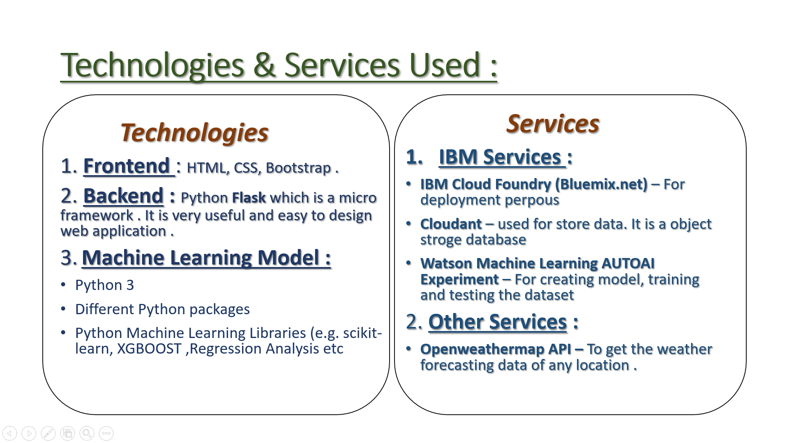
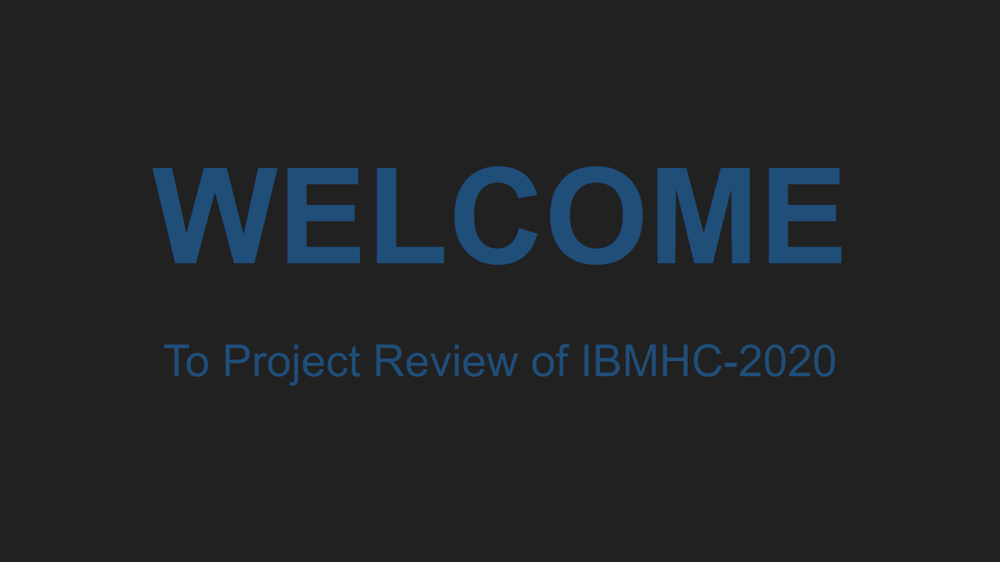

# **Predicting the energy output of wind turbine based on weather condition**

## **Project Deatils :**
- Team Name --->  Response200
- Team Leader --->  SUJOY NANDI
- Project ID ---> SPS_PRO_300

### **Problem Statement and Expected Solutions :**

 Wind energy plays an increasing role in the supply of energy world-wide. The energy output of a wind farm is highly dependent on the wind conditions present at its site. If the output can be predicted more accurately, energy suppliers can coordinate the collaborative production of different energy sources more efficiently to avoid costly overproduction.<br>
 
 Develop a time series model to Predict the power output of wind farm based on the weather condition in the site (1Hr prediction to 72Hrs. prediction) Build an application to recommend the Power Grid to suggest the best time to utilize the energy from wind farm.

<hr>

## **My Solution :** 
To solve this problem I have made a Web Application. So I have developed a Machine Learning Model which can be used to predict OUTPUT POWER of ‘the wind power-plant’ depending on whether conditions for a specific future day.

### **How it Works ?** 
It is very easy to use. You just have to few details :

1. Set the Time Range for Prediction

2. Redius of Turbine Rotor

3. Efficiency of Turbine

**<i>Done !!! <br> Then, Our model will suggest you the best time in next 72 hours ( or in the selected time ) to utilize the energy from wind farm. So that the turbine returns maximum OUTPUT POWER .</i>**
<br><br>
### **Why Rotor redius and Efficiency is required ?**
Here this ML Model is built based on a feature called 'Theoretical Power'. So to calculate Theoretical power we must know Rotor Redius and Efficiency of a turbine. Moreover one Power Grid have many Turbines and each turbine has different Redius and Efficiency, Therefore their 'Theoretical Power' will be different from each other.

### <u>App Name</u> :
```
 Wind Turbine Power Prediction
```
NOTE : <br>1. This App is deployed on IBM Cloud.
       <br>2. **Responsive Design:** The design of site is responsive i.e it can be viewd on any device without facing any trouble.<br><br>


### **<u>App Link :</u>** 
```
 https://wind-turbine-power-prediction.eu-gb.mybluemix.net/
```

Please , Visit the app to know how it works .<br><br><br>
***NOTE : This model is trained on Wind Turbine Scada Dataset on 2018 of a Wind Turbine in Turkey.**

<hr>

## **Technology Stack and Other Services :**
Here is some technologies and services that are used to develop this Web App.




<center></center>


<center></center>


<hr>

## **Video Presentation and Other links :**
[<center></center>](https://youtu.be/f360LuEqjlc)

Dataset Source :
```
https://www.kaggle.com/berkerisen/wind-turbine-scada-dataset
```

<hr>

## **LICENSE :**

Apache License
                                    Version 2.0, January 2004
                                  http://www.apache.org/licenses/

   TERMS AND CONDITIONS FOR USE, REPRODUCTION, AND DISTRIBUTION

1. Definitions.

      "License" shall mean the terms and conditions for use, reproduction,
      and distribution as defined by Sections 1 through 9 of this document.

      "Licensor" shall mean the copyright owner or entity authorized by
      the copyright owner that is granting the License.

      "Legal Entity" shall mean the union of the acting entity and all
      other entities that control, are controlled by, or are under common
      control with that entity. For the purposes of this definition,
      "control" means (i) the power, direct or indirect, to cause the
      direction or management of such entity, whether by contract or
      otherwise, or (ii) ownership of fifty percent (50%) or more of the
      outstanding shares, or (iii) beneficial ownership of such entity.

      "You" (or "Your") shall mean an individual or Legal Entity
      exercising permissions granted by this License.

      "Source" form shall mean the preferred form for making modifications,
      including but not limited to software source code, documentation
      source, and configuration files.

      "Object" form shall mean any form resulting from mechanical
      transformation or translation of a Source form, including but
      not limited to compiled object code, generated documentation,
      and conversions to other media types.

      "Work" shall mean the work of authorship, whether in Source or
      Object form, made available under the License, as indicated by a
      copyright notice that is included in or attached to the work
      (an example is provided in the Appendix below) ... [Read More](./LICENSE)

      


